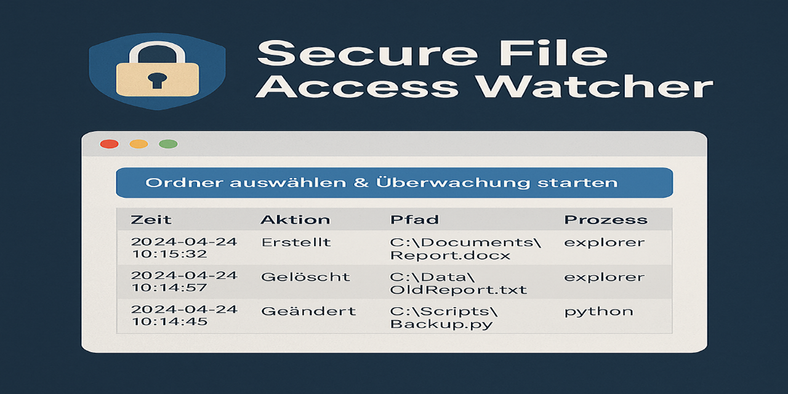

# 🔐 Secure File Access Watcher

||
|---|

## 🇩🇪 Beschreibung (Deutsch)

**Secure File Access Watcher** ist ein leichtgewichtiges Python-Tool zur Überwachung von Datei- und Ordnerzugriffen auf dem lokalen System – in Echtzeit und vollständig DSGVO-konform. Die Anwendung erkennt Dateiänderungen (Erstellen, Löschen, Modifizieren) und speichert alle Ereignisse inklusive Zeit, Pfad und Benutzer in einer übersichtlichen Oberfläche.

### ✅ Funktionen

- Live-Überwachung von Dateiaktivitäten (Watchdog-basiert)
- Interaktive Benutzeroberfläche mit tabellarischer Darstellung
- Export der Zugriffshistorie als CSV oder JSON
- 100 % lokal – keine Cloud, keine Telemetrie

---

## EN Description (English)

**Secure File Access Watcher** is a lightweight Python-based utility for real-time monitoring of file and folder access on your local system – fully privacy-compliant and offline. It tracks file modifications (created, deleted, modified) and displays events with timestamps, paths, and user context in a clean GUI.

### ✅ Features

- Real-time file access monitoring (Watchdog-based)
- Interactive table-based user interface
- Export logs as CSV or JSON
- 100% local – no cloud, no telemetry

---

## 🛠️ Installation / Setup

```bash
pip install -r requirements.txt
python main.py
```

---

## 📁 Projektstruktur / Project Structure

```
secure_file_access_watcher/
├── main.py           # Einstiegspunkt / Entry point
├── gui.py            # GUI-Logik / User Interface
├── watcher.py        # Ereignisüberwachung / Filesystem event handler
├── exporter.py       # Export der Logs / Export functionality
├── requirements.txt  # Abhängigkeiten / Dependencies
└── README.md         # Dieses Dokument / This file
```

---

## 🛡️ Datenschutz / Privacy

Alle Zugriffe werden ausschließlich lokal analysiert und verarbeitet.  
Es erfolgt **keine Datenübertragung an externe Systeme**.  
Die Anwendung ist vollständig **DSGVO-konform**.

---

## 📃 Lizenz / License

MIT License – [LICENSE](LICENSE)
